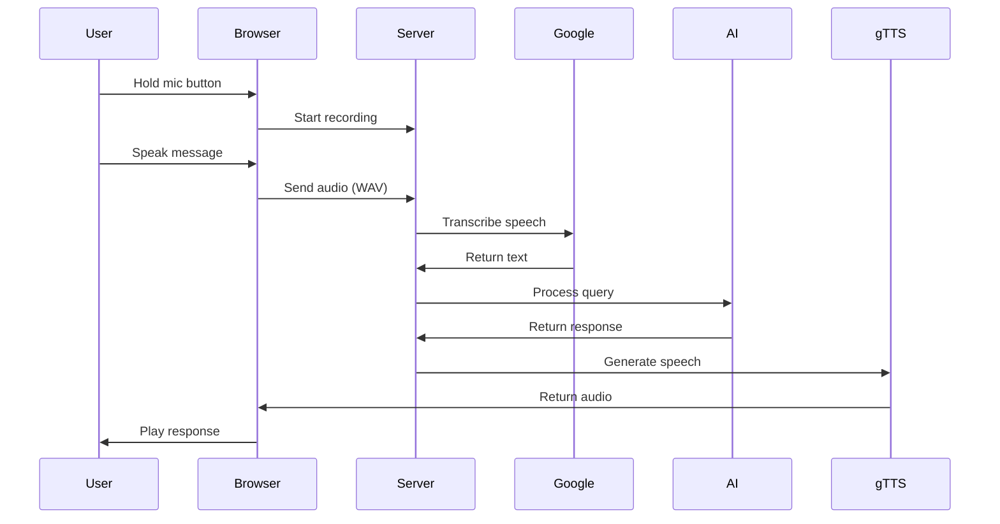

````markdown
# DjChat - AI-Powered Chat Application with Django


*A real-time chat application with AI conversation capabilities*

---

## Table of Contents
- [Features](#features)
- [Installation](#installation)
- [Configuration](#configuration)
- [Usage](#usage)
- [AI Models](#ai-models)
- [Voice Features](#voice-features)
- [Project Structure](#project-structure)
- [API Reference](#api-reference)
- [Troubleshooting](#troubleshooting)
- [Contributing](#contributing)
- [License](#license)

---

## Features

### Core Chat Functionality
- **Real-time messaging** using AJAX polling
- **Multiple concurrent chat rooms**
- **User authentication** system
- Message history persistence
- Responsive Bootstrap 5 interface

### AI Conversation System
- Multiple AI model support
- Context-aware conversations
- Model switching during chats
- Conversation history tracking

### Voice Interaction
- Browser-based audio recording
- Speech-to-text transcription
- AI voice responses
- Hold-to-talk interface

---

## Installation

### Prerequisites
- Python 3.8+
- pip package manager
- Modern web browser
- Microphone (for voice features)

### Setup Instructions

1.  **Clone the repository:**
    ```bash
    git clone [https://github.com/yourusername/djchat.git](https://github.com/yourusername/djchat.git)
    cd djchat
    ```

2.  **Create and activate virtual environment:**
    ```bash
    python -m venv venv
    # Windows:
    venv\Scripts\activate
    # Mac/Linux:
    source venv/bin/activate
    ```

3.  **Install dependencies:**
    ```bash
    pip install -r requirements.txt
    ```

4.  **Set up database:**
    ```bash
    python manage.py migrate
    ```

5.  **Create admin user** (optional):
    ```bash
    python manage.py createsuperuser
    ```

6.  **Run development server:**
    ```bash
    python manage.py runserver
    ```

---

## Configuration

Create a `.env` file in the project root with these variables:

```ini
GEMINI_API_KEY=your_google_api_key
DEBUG=True
SECRET_KEY=your_django_secret_key
ALLOWED_HOSTS=localhost,127.0.0.1
````

For HTTPS (required for microphone access):

```bash
pip install django-extensions
python manage.py runserver_plus --cert-file cert.crt
```

-----

## Usage

### Basic Chat

1.  Access `http://localhost:8000` in your browser
2.  Register or log in with existing credentials
3.  Join an existing room or create a new one
4.  Type messages in the chat input and send

### AI Chat

1.  Select an AI model from the navigation bar
2.  For text models:
      - Type your message in the input field
      - Press Send or Enter key
3.  For Gemini Live (voice):
      - Press and hold the microphone button
      - Speak your message
      - Release to send
      - Listen to the AI's voice response

-----

## AI Models

| Model Name | Type | Description | Best For |
|------------|------|-------------|----------|
| DialoGPT | Text | Microsoft's conversational model | General chat |
| Gemini 2.5 Pro | Text | Google's advanced reasoning model | Complex queries |
| Gemini Live | Voice | Real-time voice interaction | Hands-free use |

-----

## Voice Features

### Technical Implementation



-----

## Project Structure

```
djchat/
├── textapp/                # Main application
│   ├── migrations/         # Database migrations
│   ├── static/             # Static files (CSS/JS)
│   │   ├── css/
│   │   └── js/
│   ├── templates/          # HTML templates
│   │   ├── ai_chat.html
│   │   └── room.html
│   ├── models.py           # Database models
│   ├── views.py            # Application logic
│   └── urls.py             # URL routing
├── djchat/                 # Project config
│   ├── settings.py         # Django settings
│   ├── urls.py             # Main URLs
│   └── wsgi.py             # WSGI config
├── .env                    # Environment vars
├── requirements.txt        # Dependencies
└── manage.py               # Django CLI
```

-----

## API Reference

### Endpoints

| Endpoint | Method | Description |
|----------|--------|-------------|
| `/ai-response/` | POST | Process AI chat messages |
| `/getMessages/<room>/` | GET | Fetch room messages |
| `/send/` | POST | Send new message |

### Example Request

```python
import requests

response = requests.post(
    'http://localhost:8000/ai-response/',
    data={
        'message': 'Hello AI',
        'model': 'gemini-2.5-pro',
        'conversation_id': '12345'
    },
    headers={'X-CSRFToken': 'your_csrf_token'}
)
```

-----

## Troubleshooting

### Common Issues

| Symptom | Solution |
|---------|----------|
| Microphone not working | 1. Use HTTPS\<br\>2. Check browser permissions |
| AI not responding | 1. Verify API keys\<br\>2. Check internet connection |
| Chat not updating | 1. Disable ad blockers\<br\>2. Ensure JavaScript is enabled |

### Error Messages

  - **"Microphone access denied"**: Refresh page and allow microphone access
  - **"AI service unavailable"**: Check your API keys and internet connection
  - **"CSRF verification failed"**: Refresh page and try again

-----

## Contributing

1.  Fork the repository
2.  Create your feature branch (`git checkout -b feature/AmazingFeature`)
3.  Commit your changes (`git commit -m 'Add some AmazingFeature'`)
4.  Push to the branch (`git push origin feature/AmazingFeature`)
5.  Open a Pull Request

-----

## License

Distributed under the MIT License. See `LICENSE` for more information.

-----

**Note**: For production deployment, additional security configurations are required including proper HTTPS setup, CSRF protection, and database optimization.

```
```
